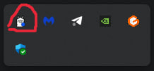

first you need to download OLLAMA (https://ollama.com/)

to download a model:
```
ollama pull mistral:7b
```

to run a model:
```angular2html
ollama run mistral:7b
```

we must run the model in cmd so that it is local on the computer. without this .py will not run

 

in my case, I see the OLLAMA icon on the bottom right as proof that the model exists.

```angular2html
pip install requirements.txt
```
i use Python 3.12.6

then just go to any of the tests and run it

test 1 - multiple tool calling

test 2 - tool calling with a strong prompt 
